  

 

  
  
  
  

---

## 👋 About Me

I am a **Master of Science in Computer Science student at the University of Southern California**, focused on building practical **machine learning, NLP, and document-intelligence systems**.

My experience spans software development, data-driven applications, and technology risk. I am currently strengthening my applied AI engineering skills through production-oriented projects involving **LLMs, retrieval-augmented generation, backend APIs, evaluation, and deployment**.

I am seeking **Software Engineering, Machine Learning, and Applied AI internship opportunities** where I can build reliable systems and turn research ideas into useful products.

---

## 🚀 Currently Building

<table>
  <tr>
    <td width="72%" valign="top">
      <h3>🧠 DocMind</h3>
      
<strong>An AI document-intelligence assistant currently in development.</strong>

      
DocMind is my independent capstone project, focused on helping users upload documents, retrieve relevant information, and receive grounded answers with citations. The project is currently in the requirements and system-design stage, with the RAG pipeline, evaluation, backend, and deployment planned incrementally.

      
<strong>Focus:</strong> Document AI · RAG · LLM evaluation · FastAPI · Vector search

    </td>
    <td width="28%" align="center" valign="middle">
      
    </td>
  </tr>
</table>

---

## ✨ Featured Projects

<table>
  <tr>
    <td width="50%" valign="top">
      <h3>🚦 RoadSafe Adapt</h3>
      
Research-oriented work exploring adaptation techniques for road-scene understanding and safety-focused computer vision.

      
<strong>Computer Vision · Deep Learning · Domain Adaptation</strong>

      
    </td>
    <td width="50%" valign="top">
      <h3>📈 Insurance Cost Prediction</h3>
      
A machine-learning project for estimating insurance costs using structured data and predictive modeling.

      
<strong>Python · Machine Learning · Data Analysis</strong>

      
    </td>
  </tr>
  <tr>
    <td width="50%" valign="top">
      <h3>🥗 MyDietDiary</h3>
      
A full-stack application for tracking meals and supporting more informed dietary decisions.

      
<strong>Web Development · Database · Application Design</strong>

      
    </td>
    <td width="50%" valign="top">
      <h3>🔎 More Projects</h3>
      
Explore my other work across machine learning, software engineering, data, and web applications.

      
<strong>Experiments · Coursework · Applications</strong>

      
    </td>
  </tr>
</table>

---

## 🧰 Technical Stack

**Languages & Data**

**Machine Learning & AI**

**Backend, Storage & Cloud**

---

## 📊 GitHub Activity

  
  

 

  

---

## 🤝 Connect With Me

  
I am open to conversations about software engineering, machine learning, applied AI, and internship opportunities.

  
  

 

  Building useful systems, one commit at a time.

